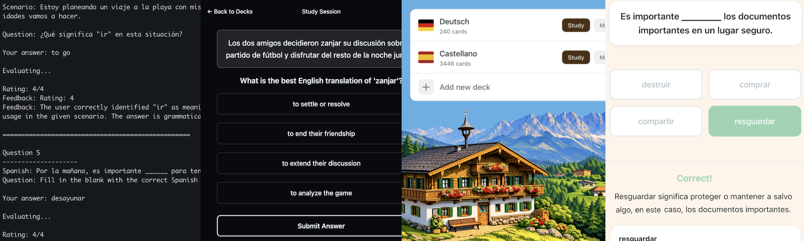

# LLM Language Quiz Experiments

**TL;DR: I deployed an LLM-powered vocabulary acquisition tool and learned some lessons about LLM content generation. To better understand how to get the most out of LLMs, I'm taking a more structured/data-driven approach with experiments.**

To better enjoy content (books and TV shows) in Spanish, I regularly invested time in studying vocabulary. My process was: when I found a word I didn't know I would add it to a spaced repetition flashcard deck and review them on a daily basis (well... not 100% daily). Spaced repetition flashcards work great and their effectiveness is backed by research, but I have found some pain points in long-term use:

1. **Studying flashcards connects the front of a card to the back**. Memorizing a word's definition or translation is not acquiring it. The learner must read or hear the word several times in context to understand when and how it is used.
1. **Memorizing the wrong thing**. Some words have multiple unrelated definitions and its not feasible to cover all of them in a single review.
1. **Not fully acquiring all facets of a word**. Words can have contextual meanings, irregular forms when conjugated, pronunciation and associated attributes (like noun class or gender). It's challenging to capture all of these facets on a single flashcard.
1. **User-provided ease ratings are subjective**. Spaced repetition systems require user input to determine how to schedule a review. This input is subjective and it's difficult to be consistent and accurate.
1. **Missing out on grammar/usage practice**. Time spent memorizing vocabulary is time not spent practicing how to use that vocabulary.

Fueled by the new vibe-coding paradigm, I built an LLM-powered vocabulary acquisition app to address these problems. Below are some screenshots from it's evolution.

After iterating on question generation and evaluation techniques, I became familiar with a new set of problems:

1. **Correctness**. Hallucinations, prompt issues, and poorly designed questions can result in incorrect content being displayed to the user. Inaccurate or incorrect content breaks user trust and is an extremely bad user experience.
1. **Response time**. The big frontier models can take 5-30 seconds to generate content. This is too much time to be waiting for a new question or feedback on an answered question. This can be avoided by asynchronously generating questions that don't require a second LLM call for grading (ex: multiple choice questions).
1. **Cost**. Generating content costs energy, time, and money.

Correctness is a make-or-break issue for using LLMs for learning material. If the system can generate diverse learning content with high correctness, response time, and cost are factors that can be addressed later. Instead of iterating within the vocabulary acquisition app, I created a new tool to experiment with prompting, evaluation techniques and models.

## Comparisons of gpt-4 and gpt-5 model families generating Basic German Grammar quiz questions

This is a series of small (n=~300) trial experiments with some of the OpenAI frontier models:

- Unsurprisingly, bigger and more recent models are better at this task. There are diminishing returns with the gpt-5 family. The current cost/performance winner is gpt-5-mini.
- Structured output of all modes (prompt_only, json_mode, and schema) in the gpt-4 family is great and during the gpt-4 runs 100% of requests successfully parsed as valid JSON. Schema mode is 30% faster than prompt_only and json_mode.
- The editor evaluator (receives the question content with the blank filled in) is both time and cost efficient for finding inaccurate questions, while the teacher (has full view of question) is expensive but can catch pedagogical errors.

Detailed reports:

- [Comparison of gpt4 family models](reports/e01_gpt4o_comparison.md)
- [Comparison of gpt4 output modes](reports/e02_output_mode_comparison.md)
- [Comparison of gpt4 and gpt5](reports/e05_gpt5_model_comparision.md)

## Local MLX Models for German Grammar Quiz Generation

Fired up some small (3-22B) local models and tested their out-of-the-box performance. Pretty cool to see what is possible with local models.

- Each model is unique in its configuration and features: some have thinking mode, some perform very poorly with structured output, others are trained in a way that makes them want to output Python code. I didn't run this experiment with all the models I tested, only the ones I was able to consistently get parsable JSON.
- The Qwen3.5 family of models was released recently and performs well for something that can fit on a laptop. Qwen3.5-27B performs better than Qwen3.5-9B, at the cost of slower inference and more memory.
- EuroLLM-22B-Instruct-2512 is an interesting model, but it had trouble with understanding the task of generating quiz questions. If better prompting or fine-tuning would help it understand the task, it's possible it could outperform Qwen3.5-9B and/or Qwen3.5-27B.

Detailed reports:

- [Comparing Different Local Model Architectures](reports/e03_local_model_comparison.md)
- [Comparing Qwen3.5 sizes and quantization](reports/e04_qwen35_quantization_comparison.md)
